# Manual de utilização do gestor

## Objetivo

Este manual explica como utilizar a área de administração da plataforma We.Did.It. A área de gestão permite moderar notícias e testemunhos, organizar categorias, formações e eventos, criar newsletters e gerir as contas de administrador.

As instruções descrevem os ecrãs atualmente disponíveis e incluem capturas de ecrã de apoio.

## Aceder à área de administração

1. Abra a página inicial da plataforma.
2. Selecione **Login**.
3. Introduza o email e a palavra-passe da conta de administrador.
4. Selecione **Entrar**.

Depois da autenticação, a aplicação abre o **Painel Administrativo**. Para terminar a sessão, abra o menu com o seu nome, no canto superior direito, e selecione **Sair**.

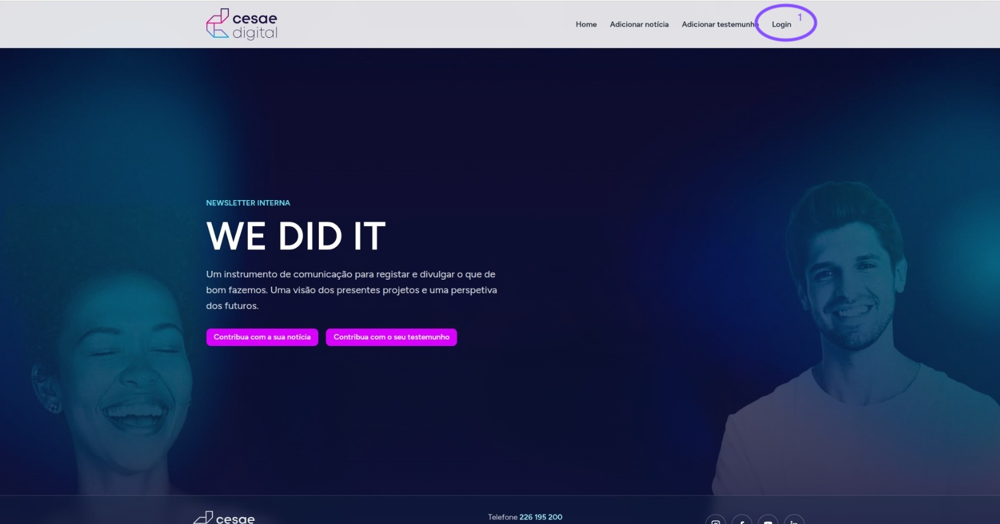

*Figura 1 - Página inicial: selecione `Login` para aceder à área de administração.*

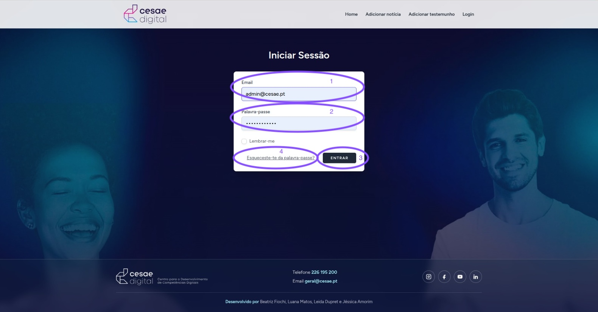

*Figura 2 - Página de login: 1. introduza o email; 2. introduza a palavra-passe; 3. selecione Entrar para aceder ao painel; 4. selecione Esqueceste-te da palavra-passe? para recuperar o acesso.*

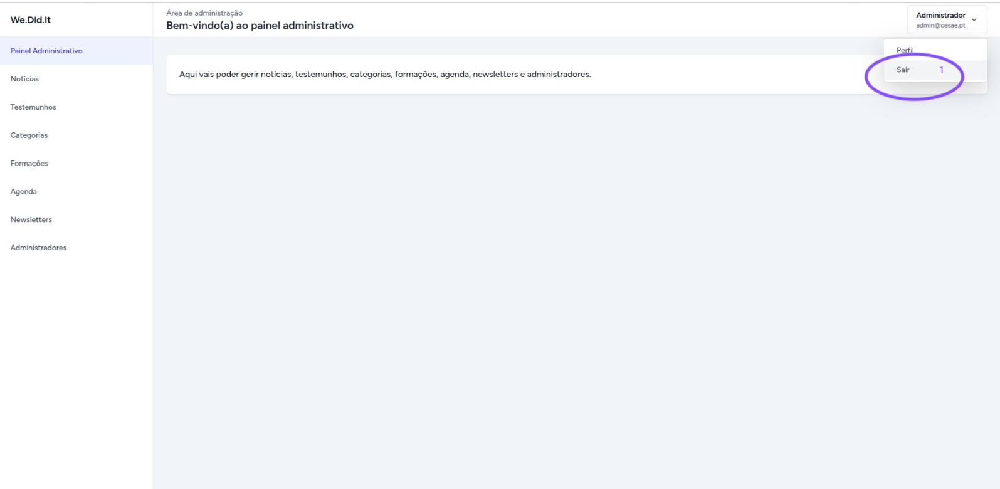

*Figura 2.1 - Sair da conta: 1. abra o menu da conta, no canto superior direito; 2. selecione **Sair** para terminar a sessão com segurança.*

### Recuperar a palavra-passe

Se não se lembrar da palavra-passe, na página de login selecione `Esqueceste-te da palavra-passe?`.

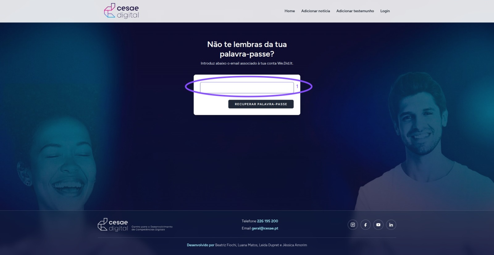

*Figura 3 - Pedido de recuperação: 1. introduza o email associado à conta; 2. selecione `Recuperar palavra-passe`.*

Será enviado um email para o endereço indicado. Abra-o e selecione `Definir nova palavra-passe`.

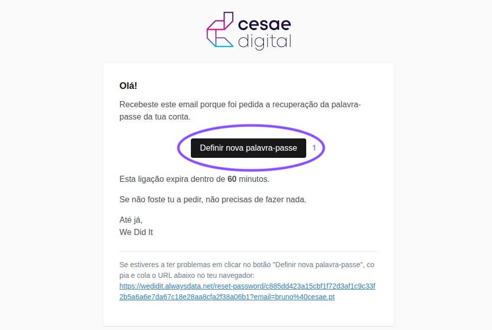

*Figura 4 - Email de recuperação: 1. selecione `Definir nova palavra-passe`. O link é válido durante 60 minutos.*

Na página seguinte, defina e confirme a nova palavra-passe.

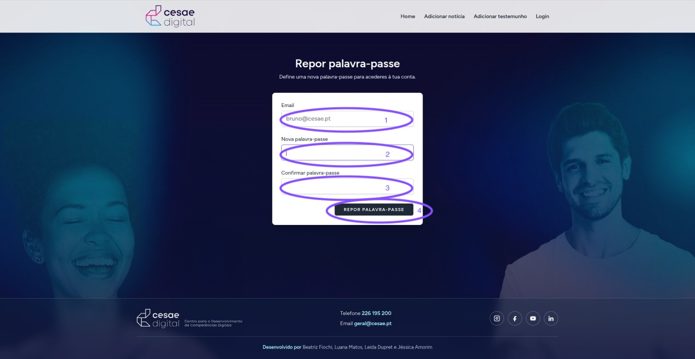

*Figura 5 - Definir nova palavra-passe: 1. introduza o email; 2. defina a nova palavra-passe; 3. confirme-a; 4. selecione `Repor palavra-passe`.*

## Navegação no painel administrativo

Após iniciar sessão, é apresentado o painel administrativo. O menu lateral permite aceder às áreas de gestão de notícias, testemunhos, categorias, formações, agenda, newsletters e administradores.

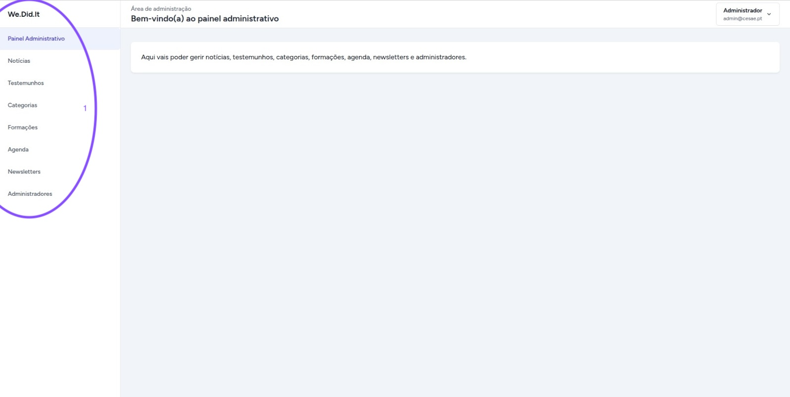

*Figura 6 - Dashboard administrativo: 1. menu lateral com as opções de gestão disponíveis para o administrador.*

Em ecrãs pequenos, selecione o ícone de menu no cabeçalho para abrir ou fechar a navegação lateral.

## Submeter conteúdo público

Qualquer utilizador pode enviar uma notícia ou um testemunho sem criar uma conta de administrador.

1. Na página inicial, selecione **Contribua com a sua notícia** ou **Contribua com o seu testemunho**. Também pode utilizar os links **Adicionar notícia** e **Adicionar testemunho** no menu superior.

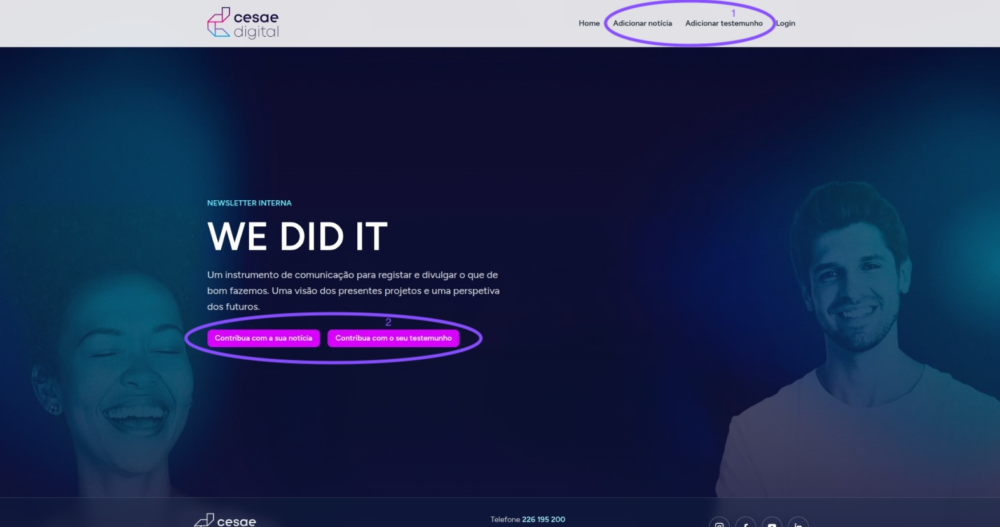

*Figura 7 - Página inicial: 1. no menu superior, selecione **Adicionar notícia** ou **Adicionar testemunho**; 2. também pode selecionar **Contribua com a sua notícia** ou **Contribua com o seu testemunho**.*

2. Preencha os campos obrigatórios do formulário.
3. Se pretender enviar imagens, selecione os ficheiros disponíveis no formulário e assinale a autorização para a sua utilização.
4. Leia e aceite a Política de Privacidade.
5. Selecione **Enviar**.

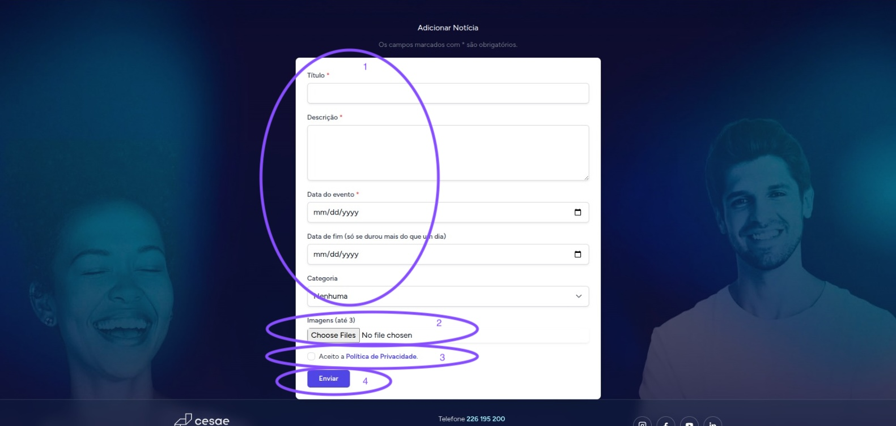

*Figura 8 - Submissão de notícia: 1. preencha os campos obrigatórios; 2. adicione imagens e assinale a autorização de utilização; 3. aceite a Política de Privacidade; 4. selecione **Enviar**.*

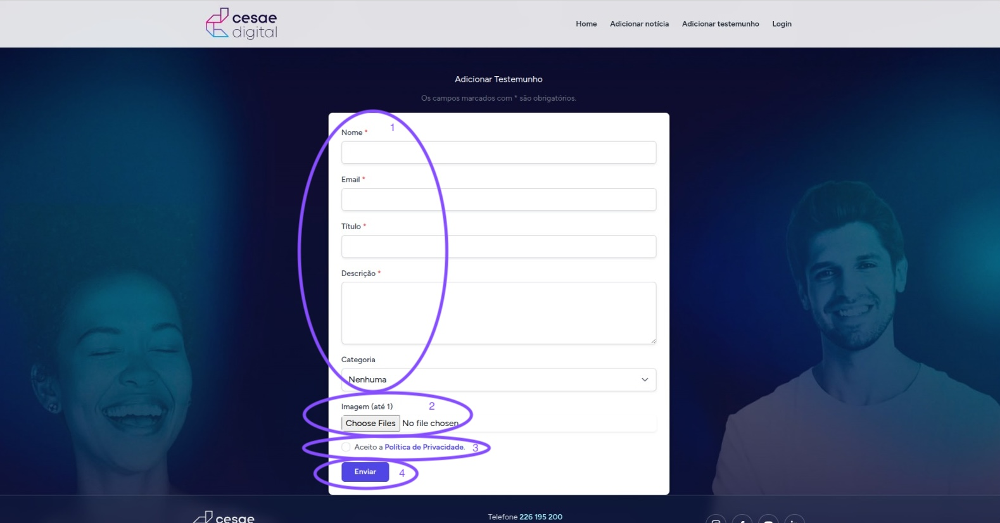

*Figura 9 - Submissão de testemunho: 1. preencha os campos obrigatórios; 2. adicione a imagem e assinale a autorização de utilização; 3. aceite a Política de Privacidade; 4. selecione **Enviar**.*

O conteúdo enviado não é publicado automaticamente. Fica disponível para revisão na área de administração.

## Gerir notícias

As notícias submetidas através do formulário público chegam à área **Notícias**. Nesta página é possível consultar os registos, pesquisar e filtrar resultados, abrir cada submissão, editar o conteúdo e moderá-lo.

Sempre que uma notícia é submetida, todos os administradores com acesso ativo recebem um email a avisar que existe conteúdo por moderar. O email inclui o botão **Abrir a moderação**, que leva diretamente à área de gestão.

1. Abra **Notícias** no menu lateral.
2. Utilize os filtros e a pesquisa para localizar a notícia pretendida.
3. Confirme o estado da submissão.
4. Selecione **Ver** para consultar o conteúdo completo.
5. Se necessário, selecione **Editar** para rever o título, a descrição, a categoria, as datas e as imagens.
6. Selecione **Aprovar** para disponibilizar a notícia para uma newsletter ou **Recusar** para a rejeitar.
7. Guarde as alterações quando terminar.

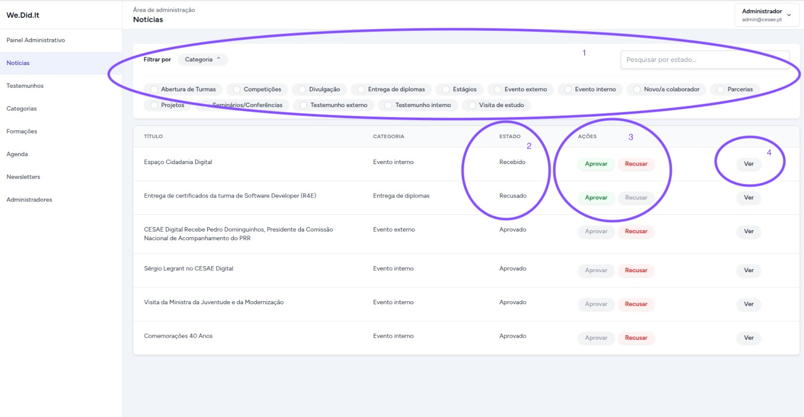

*Figura 10 - Lista de notícias: 1. filtros e pesquisa; 2. estado da submissão; 3. ações de moderação, **Aprovar** e **Recusar**; 4. selecione **Ver** para abrir o conteúdo.*

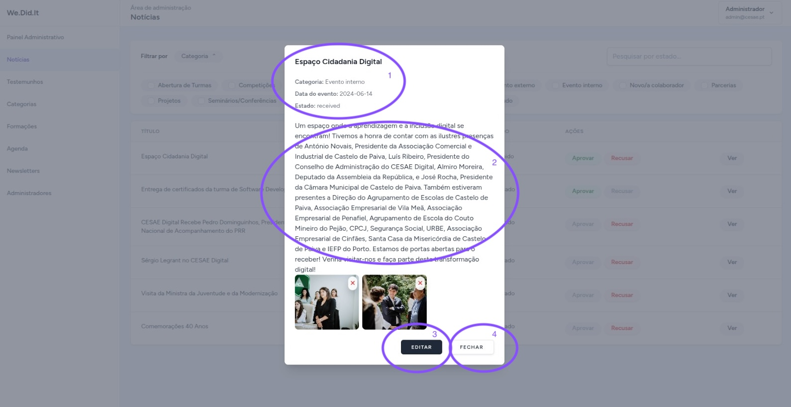

*Figura 11 - Painel de moderação de notícia: 1. dados da submissão; 2. descrição e imagens enviadas; 3. selecione **Editar** para corrigir o conteúdo antes de guardar.*

Ao editar uma notícia, pode remover uma imagem individual. Reveja as imagens existentes antes de aprovar o conteúdo.

## Gerir testemunhos

A área **Testemunhos** funciona de forma semelhante à das notícias. Os testemunhos submetidos ficam disponíveis para moderação antes de poderem ser selecionados para uma newsletter.

Sempre que um testemunho é submetido, todos os administradores com acesso ativo recebem um email de aviso para o moderar.

1. Abra **Testemunhos** no menu lateral.
2. Utilize os filtros e a pesquisa para localizar o testemunho.
3. Confirme o estado da submissão.
4. Selecione **Ver** para consultar o conteúdo completo.
5. Se necessário, selecione **Editar** para rever o conteúdo, a categoria e a imagem.
6. Selecione **Aprovar** ou **Recusar**, conforme a decisão de moderação.
7. Guarde as alterações.

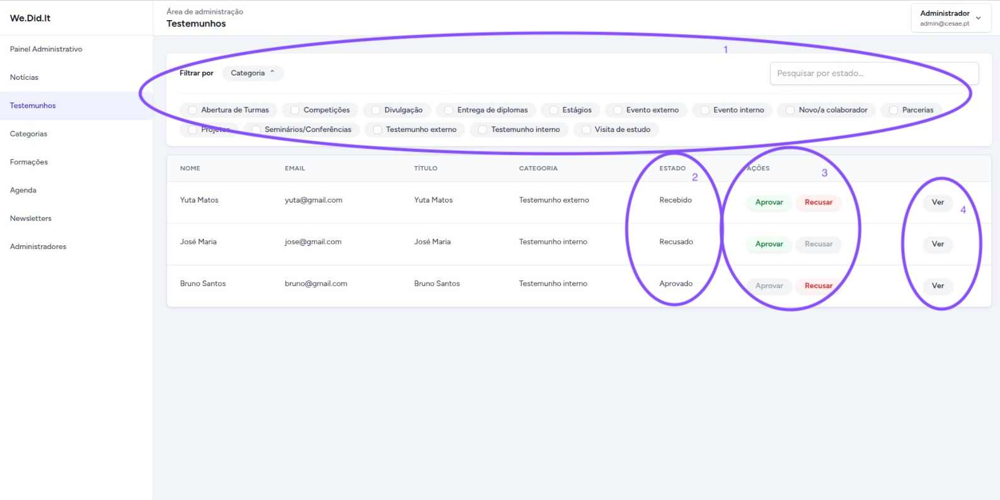

*Figura 12 - Lista de testemunhos: 1. filtros e pesquisa; 2. estado da submissão; 3. ações de moderação, **Aprovar** e **Recusar**; 4. selecione **Ver** para abrir o conteúdo.*

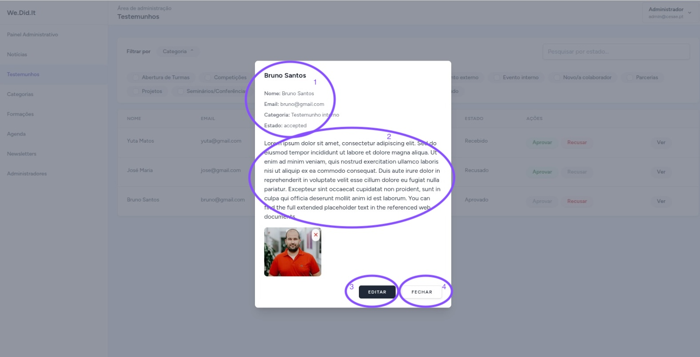

*Figura 13 - Painel de moderação de testemunho: 1. dados da submissão; 2. texto e imagem enviados; 3. selecione **Editar** para corrigir o conteúdo antes de guardar.*

## Gerir categorias

As categorias organizam notícias e testemunhos, facilitando a pesquisa, a moderação e a seleção de conteúdos para newsletters.

1. Abra **Categorias** no menu lateral.
2. Introduza o nome no campo **Nome da categoria**.
3. Selecione **Criar categoria**.
4. Utilize **Editar** para alterar uma categoria existente.
5. Atualize o nome e selecione **Guardar**, ou **Cancelar** para não guardar as alterações.
6. Utilize **Remover** quando a categoria deixar de ser necessária.

Uma categoria que já esteja associada a notícias ou testemunhos não pode ser removida. As colunas **Notícias** e **Testemunhos** indicam quantos conteúdos utilizam cada categoria.

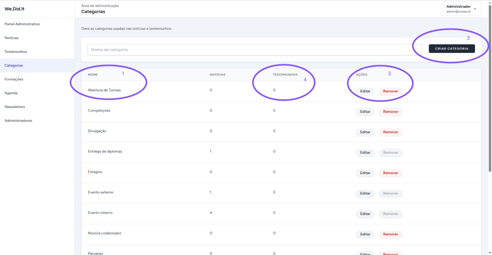

*Figura 14 - Lista de categorias: 1. introduza o nome da nova categoria; 2. selecione **Criar categoria**; 3. utilize **Editar** ou **Remover**; 4. consulte a quantidade de notícias e testemunhos associada à categoria.*

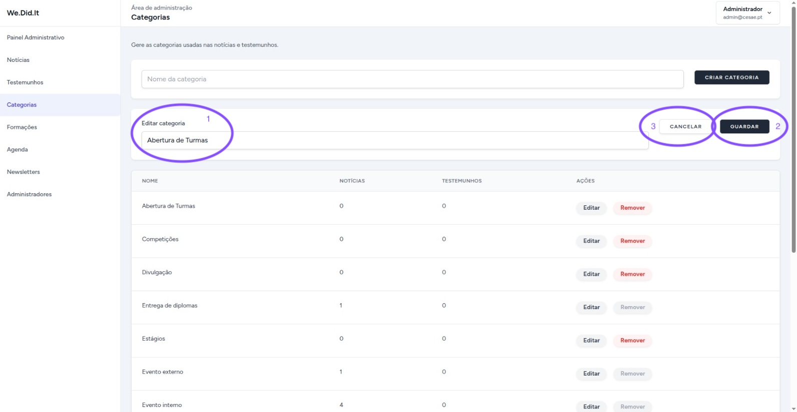

*Figura 15 - Editar categoria: 1. altere o nome; 2. selecione **Guardar** para confirmar; 3. selecione **Cancelar** para abandonar a edição.*

## Gerir formações

A área **Formações** permite consultar, importar, criar, editar e remover ofertas formativas.

1. Abra **Formações** no menu lateral.
2. Para importar automaticamente as ofertas formativas disponíveis, selecione **Importar cursos**.
3. Para criar uma formação manualmente, selecione **Nova formação** e preencha os campos necessários.
4. Utilize **Editar** para alterar os dados de uma formação já criada ou importada.
5. Se necessário, associe a formação a uma ou mais newsletters.
6. Selecione **Guardar** ou **Atualizar** para confirmar as alterações.
7. Utilize **Remover** apenas quando a formação já não for necessária.

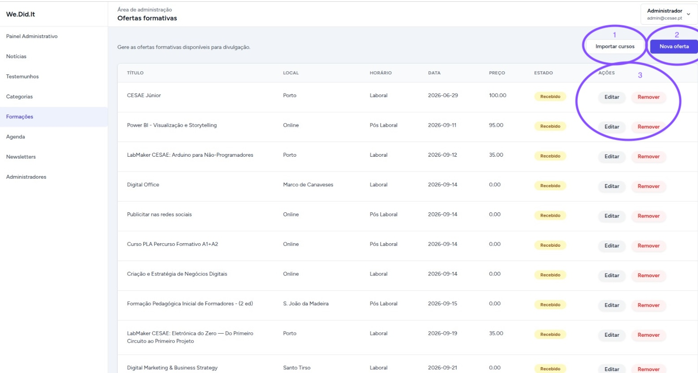

*Figura 16 - Lista de formações: 1. selecione **Importar cursos** para importar ofertas automaticamente; 2. selecione **Nova formação** para criar uma formação manualmente; 3. utilize **Editar** ou **Remover** para gerir uma oferta existente.*

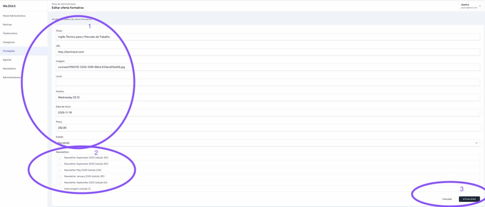

*Figura 17 - Editar formação: 1. reveja ou altere os dados da oferta formativa; 2. selecione as newsletters às quais a formação deve ficar associada, quando aplicável; 3. selecione **Atualizar** para guardar as alterações.*
                  
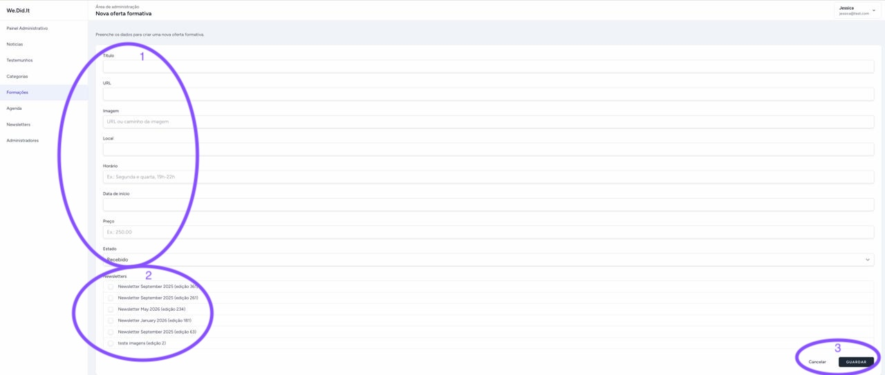

*Figura 18 - Criar formação manualmente: 1. preencha os dados da nova oferta formativa; 2. selecione newsletters, quando aplicável; 3. selecione **Criar** para guardar a formação.*

## Gerir agenda

A área **Agenda** permite criar, editar e remover eventos que podem ser incluídos numa newsletter.

1. Abra **Agenda** no menu lateral.
2. Selecione **Novo evento** para adicionar um evento.
3. Preencha o título e a data do evento.
4. Selecione **Criar** para guardar o novo evento.
5. Utilize **Editar** para alterar um evento existente e **Guardar** para confirmar as alterações.
6. Utilize **Remover** quando o evento deixar de ser necessário.

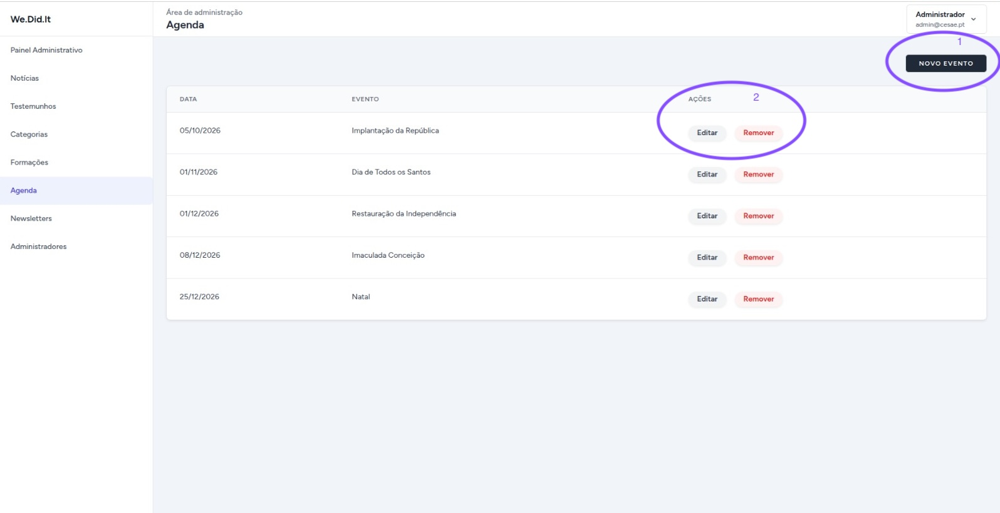

*Figura 19 - Lista de eventos da agenda: 1. selecione **Novo evento** para criar um evento; 2. utilize **Editar** ou **Remover** para gerir um evento existente.*

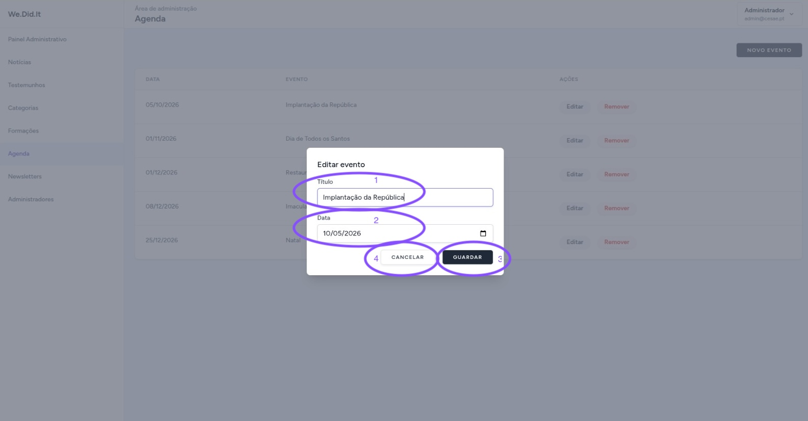

*Figura 20 - Editar evento: 1. altere o título; 2. atualize a data; 3. selecione **Guardar** para confirmar as alterações; 4. selecione **Cancelar** para abandonar a edição.*

*Figura 21 - Criar evento: 1. introduza o título; 2. selecione a data; 3. selecione **Criar** para guardar o novo evento; 4. selecione **Cancelar** para abandonar a criação.*

## Gerir newsletters

A área **Newsletters** permite criar rascunhos, selecionar conteúdos, rever a pré-visualização, exportar para PDF e publicar uma edição.

### Criar e editar uma newsletter

1. Abra **Newsletters** no menu lateral.
2. Selecione **Nova newsletter**.
3. Introduza o título, o número da edição e o período a que a newsletter se refere.
4. Selecione **Guardar rascunho**.
5. Utilize **Editar** para alterar as informações de uma newsletter que ainda esteja em rascunho.

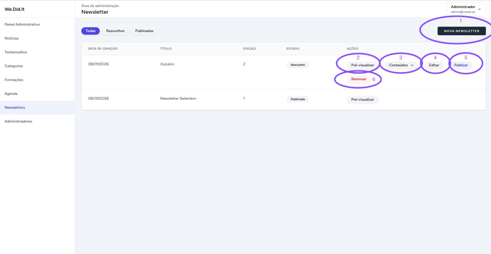

*Figura 22 - Lista de newsletters: 1. criar uma newsletter; 2. abrir a pré-visualização; 3. selecionar conteúdos; 4. editar um rascunho; 5. publicar a newsletter; 6. remover um rascunho.*

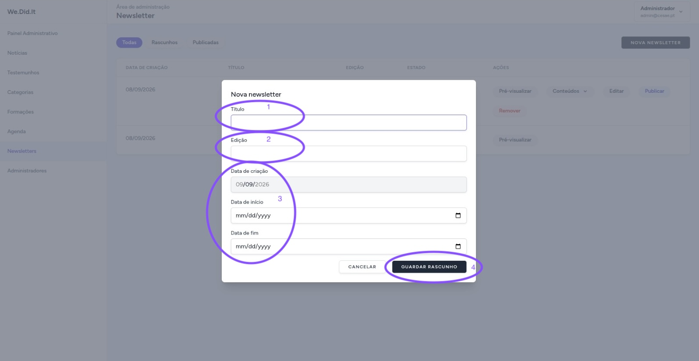

*Figura 23 - Criar newsletter: 1. introduza o título; 2. indique o número da edição; 3. defina o período da newsletter; 4. selecione **Guardar rascunho**.*

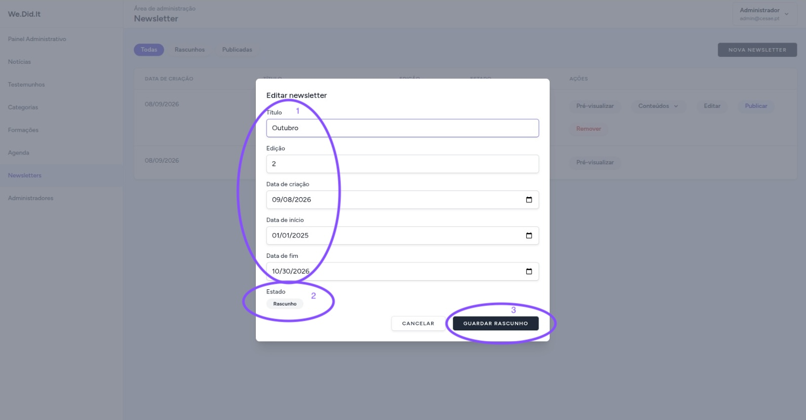

*Figura 24 - Editar newsletter: 1. altere o título, a edição ou as datas; 2. consulte o estado atual; 3. selecione **Guardar rascunho** para confirmar as alterações.*

### Selecionar conteúdos

Uma newsletter em rascunho pode incluir notícias, testemunhos, formações e eventos da agenda.

1. Na linha da newsletter pretendida, abra o menu **Conteúdos**.
2. Selecione o tipo de conteúdo que pretende associar.
3. Utilize os filtros disponíveis para encontrar os itens.
4. Assinale os conteúdos a incluir.
5. Selecione **Guardar seleção** antes de voltar à newsletter.
6. Repita o processo para cada tipo de conteúdo necessário.

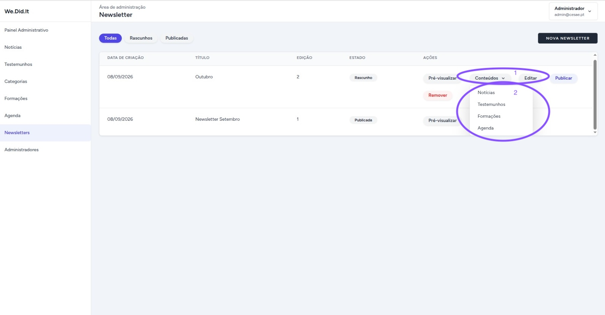

*Figura 25 - Menu Conteúdos: 1. abra o menu **Conteúdos**; 2. selecione **Notícias**, **Testemunhos**, **Formações** ou **Agenda**.*

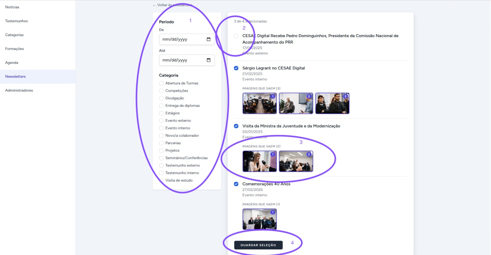

*Figura 26 - Selecionar notícias: 1. utilize os filtros; 2. assinale as notícias; 3. confirme as imagens que serão apresentadas; 4. selecione **Guardar seleção**.*

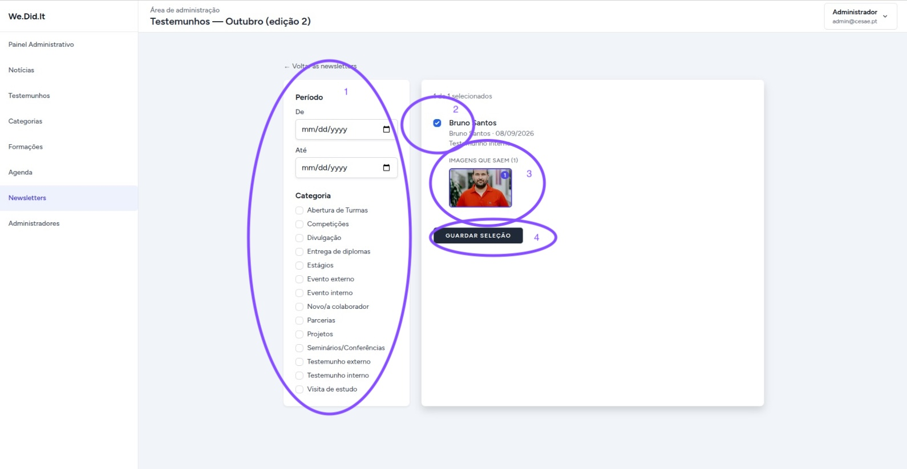

*Figura 27 - Selecionar testemunhos: 1. utilize os filtros; 2. assinale os testemunhos; 3. confirme a imagem associada; 4. selecione **Guardar seleção**.*

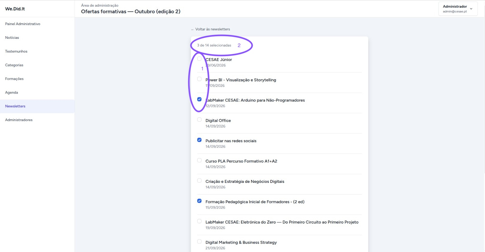

*Figura 28 - Selecionar formações: 1. assinale as formações; 2. consulte o número de itens selecionados; 3. selecione **Guardar seleção**.*

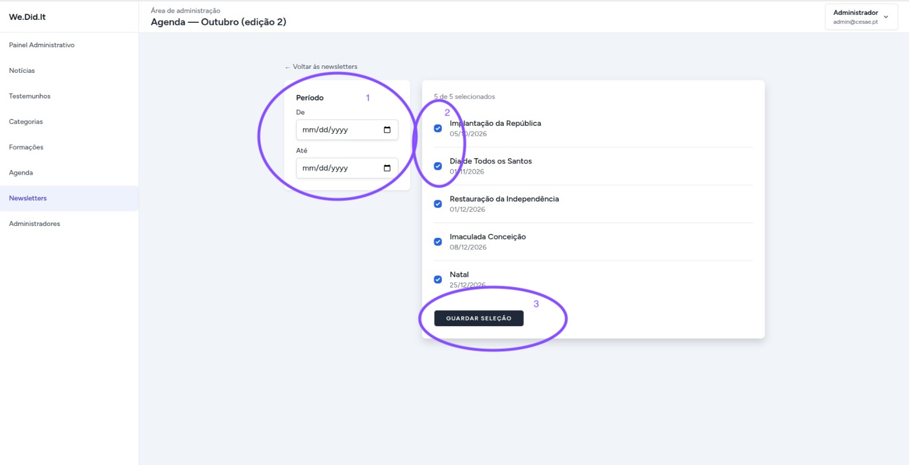

*Figura 29 - Selecionar eventos da agenda: 1. utilize o filtro por período; 2. assinale os eventos; 3. selecione **Guardar seleção**.*

### Rever, guardar em PDF e publicar

1. Selecione **Pré-visualizar** para confirmar a newsletter antes da publicação.
2. Reveja o título, a edição, o período e todos os conteúdos selecionados.
3. Se necessitar de arquivar ou partilhar a edição, selecione **Guardar em PDF**.
4. Na janela de impressão, escolha **Save as PDF** como destino.
5. Abra **More settings** e desative **Headers and footers**, para o ficheiro ficar mais limpo.
6. Selecione **Save** e escolha a pasta onde pretende guardar o ficheiro PDF.
7. Volte à listagem de newsletters e selecione **Publicar**.
8. Confirme a publicação.

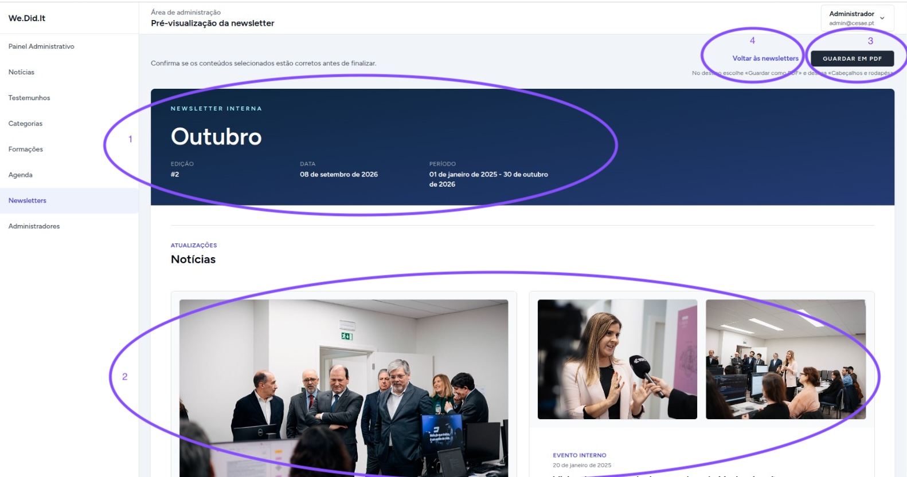

*Figura 30 - Pré-visualização da newsletter: 1. confirme o título, a edição, a data e o período; 2. reveja os conteúdos selecionados; 3. selecione **Guardar em PDF**; 4. selecione **Voltar às newsletters** quando terminar.*

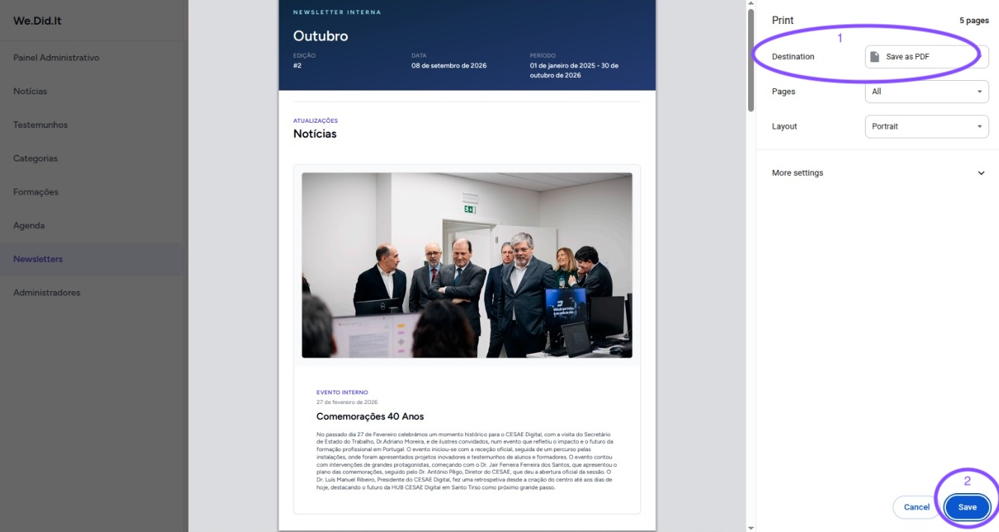

*Figura 31 - Guardar newsletter em PDF: 1. escolha **Save as PDF** como destino; 2. selecione **Save** para guardar o ficheiro.*

A publicação é irreversível: uma newsletter publicada deixa de poder ser editada, ter conteúdos removidos ou ser eliminada. Continua disponível para pré-visualização e para voltar a gerar o PDF.

## Gerir administradores

A área **Administradores** permite criar contas para outros utilizadores da equipa e controlar o respetivo acesso ao painel.

1. Abra **Administradores** no menu lateral.
2. Consulte o estado de cada conta: **Ativo** ou **Desativado**.
3. Selecione **Novo utilizador** para criar uma conta de administrador.
4. Introduza o nome, o email, uma palavra-passe inicial e a respetiva confirmação.
5. Selecione **Criar**.

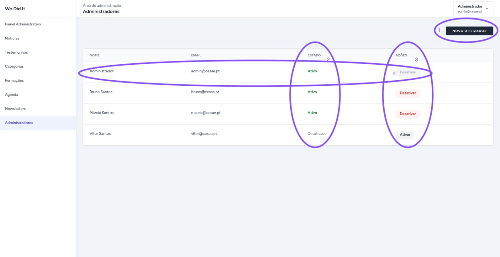

*Figura 32 - Lista de administradores: 1. selecione **Novo utilizador** para criar uma conta; 2. consulte o estado do acesso; 3. selecione **Ativar** ou **Desativar** para alterar o acesso de outro administrador; 4. a conta do administrador atualmente autenticado não pode ser ativada ou desativada por ele próprio.*

Um administrador desativado deixa de conseguir iniciar sessão. O administrador que está com sessão iniciada não pode ativar nem desativar a própria conta.

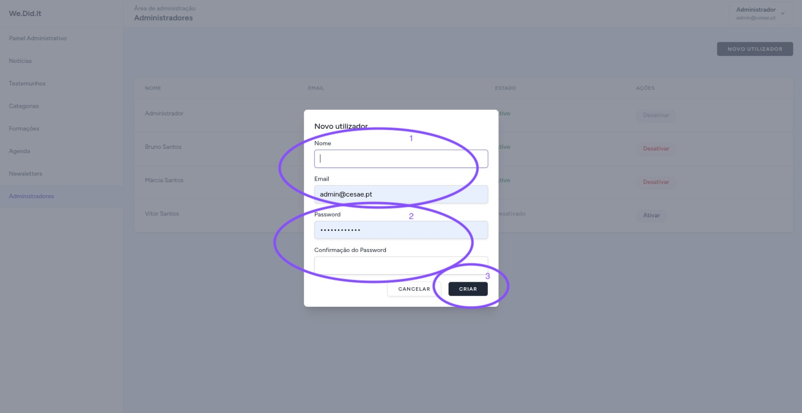

*Figura 33 - Criar administrador: 1. introduza o nome e o email; 2. defina e confirme uma palavra-passe inicial; 3. selecione **Criar**.*

Após a criação, o novo administrador recebe um email a informar que já tem acesso ao We Did It. A palavra-passe não é enviada por email, pois foi definida pelo administrador que criou a conta.

Para utilizar uma palavra-passe própria, o novo administrador deve, na página de login, selecionar **Esqueceste-te da palavra-passe?** e seguir o processo de recuperação descrito anteriormente neste manual.

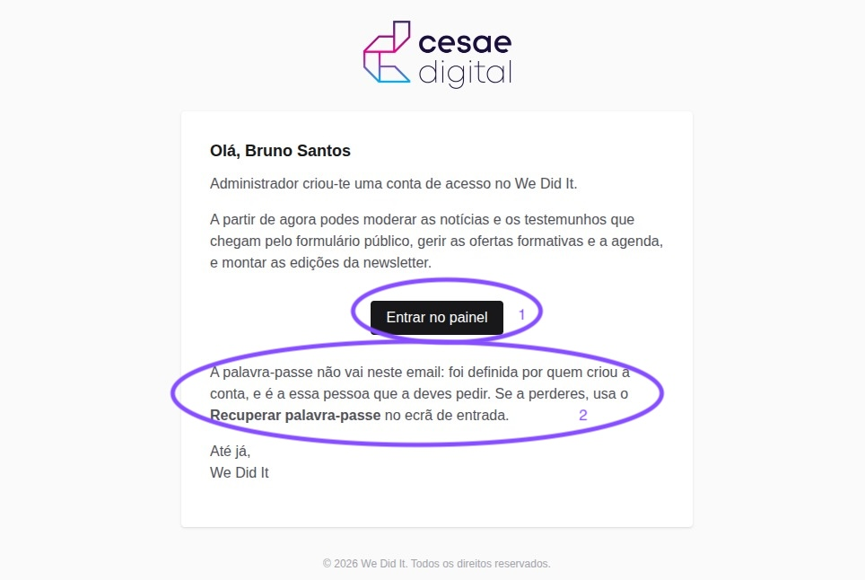

*Figura 34 - Email de criação de acesso: 1. selecione **Entrar no painel** para abrir a página de login; 2. utilize a opção **Recuperar palavra-passe** para definir uma palavra-passe pessoal.*

## Gerir o perfil

Cada administrador pode atualizar os dados da própria conta e alterar a sua palavra-passe.

1. No canto superior direito, abra o menu da conta.
2. Selecione **Perfil**.

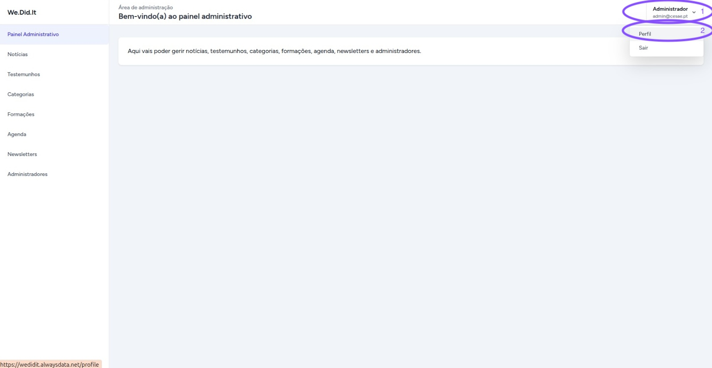

*Figura 35 - Aceder ao perfil: 1. abra o menu da conta; 2. selecione **Perfil**.*

Na página de perfil:

1. Atualize o nome e o email na área **Dados da conta**.
2. Selecione o primeiro botão **Guardar** para confirmar essas alterações.
3. Para alterar a palavra-passe, introduza a palavra-passe atual, a nova palavra-passe e a confirmação.
4. Selecione o segundo botão **Guardar** para confirmar a nova palavra-passe.

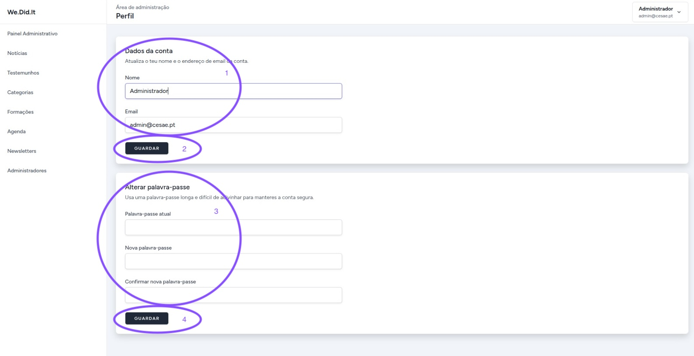

*Figura 36 - Gestão do perfil: 1. atualize o nome e o email; 2. guarde os dados da conta; 3. introduza a palavra-passe atual e a nova palavra-passe; 4. guarde a alteração da palavra-passe.*

## Boas práticas

- Reveja títulos, categorias, datas e imagens antes de aprovar uma submissão.
- Confirme os conteúdos na pré-visualização antes de publicar a newsletter.
- Guarde uma versão PDF antes ou depois da publicação quando for necessário arquivo.
- Desative contas que já não devem aceder à área de gestão, em vez de partilhar credenciais.
- Em dispositivos móveis, utilize o menu do cabeçalho e confirme que os cartões e modais apresentam toda a informação antes de guardar.

